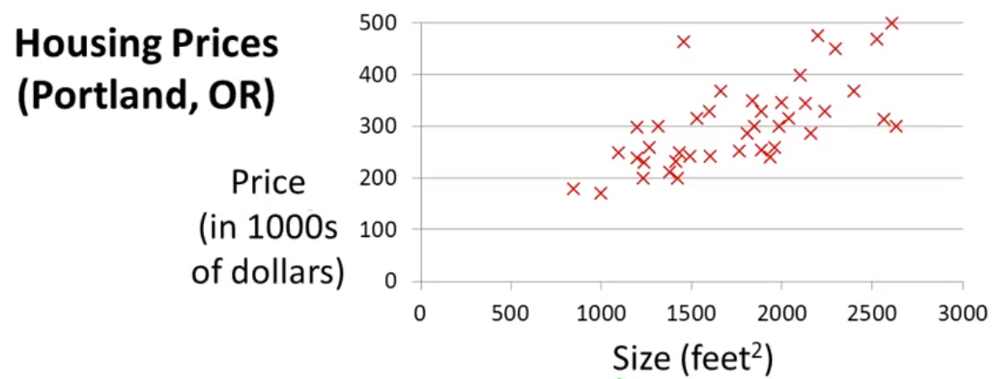
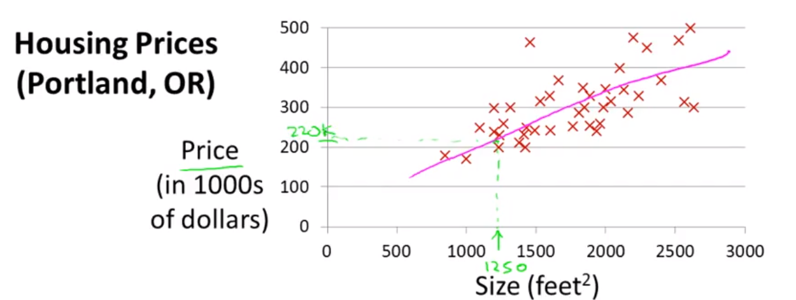

# Linear Regression with one Variable

Linear Regression is a class of supervised machine learning where we look for the answers that are real valued numbers and hence we call it **regression**.

## Predicting Housing Price

As a sample we take the task to predict the housing price of the houses in portland based on the size of the house.

We take this as a base sample data to understand the uni-variant linear regression problem. As we plot the price to size in a graph. It looks like the following.

Our goal is to develop a machine learning algorithm that can train itself to find a function that can draw a line as below so that, when a new data, say house with size as 1250 feet², using the line, we could easily predict the price to be around $220K.

### Notations

To understand the notation, Lets take the pricing data as follow:

| Size in feet² (X)| Price ($) in 1000's(Y)|
| :------ |:--- |
|2104|460|
|1416|232|
|1534|315|
|852|178|
|...|...|

In the above table, each and every record is a training example that is fed to the system. The size of the house is the input to the machine learning system and it outputs the price as a real valued number. Hence, we denote the values in the following format.

> m - Number of training Examples  x - **input** variable / feature  y - **output** variable / **target** variable

To simplify things, (x,y) is denoted as one training example, whereas X(i),Y(i) represents ith training example.

So, in the above example, X(1)=2104 and Y(3)=315.

### Model

The System gets the training set, uses some algorithm to learn the hypothesis function. Using the hypothesis function (also called the model), we predict the price for any new given size of the house.

Hypothesis(h) is the function that maps the input X to the output Y, such that `Y=h(X)`. 

The hypothesis can be represented as the following formula, for a uni-variant model
> h \theta Θ(X) = Θ0+Θ1(X)
 where Θ0 and Θ1 are parameters of the model

So, For **Θ0=1.5** and **Θ1=0** the hypothesis looks like:

And For **Θ0=0** and **Θ1=0.5** the hypothesis looks like:

So, For **Θ1=0** and **Θ1=0.5** the hypothesis looks like:

### Cost Function

Now, lets bring the graph and training examples together.

Here, the hypothesis function is the line for a given  Θ0 and  Θ1. And the X denotes the training data for say, the housing price.

We need the hypothesis function to be very close to value of Y, so that we can use this hypothesis function to calculate the output for any new input data. In other words, we need to choose Θ0,Θ1 so that h(X) is very close to Y. 

To rephrase it to a mathematical notation, our goal is to minimize the value of the difference between hypothesis and output value of the training data.

So, we are trying to minimise the squared difference between the hypothesis and actual value and averange across all the **m** training examples. We then half the difference to make the number smaller for caluclation.

The overall goal is

> 

Here we are trying to find the squared difference because it is the most commonly used method that works reasonably well than most other cost functions in a wide variety of applications.

Now, we specify the cost function as 
> 
And our overall goal is to minimize this cost function:

> 

#### Intuition

To grow a better intuition about what cost function is and what the minimisation of cost function does, we consider Θ0 to be 0.

So, our overall goal is 

> minΘ1 J(Θ1) where 

> Disclaimer: Most part of the contents in this blog are from the [Machine Learning](https://www.coursera.org/learn/machine-learning) course by Andrew Ng.

<!--stackedit_data:
eyJoaXN0b3J5IjpbMTk0MjMyMTQxXX0=
-->